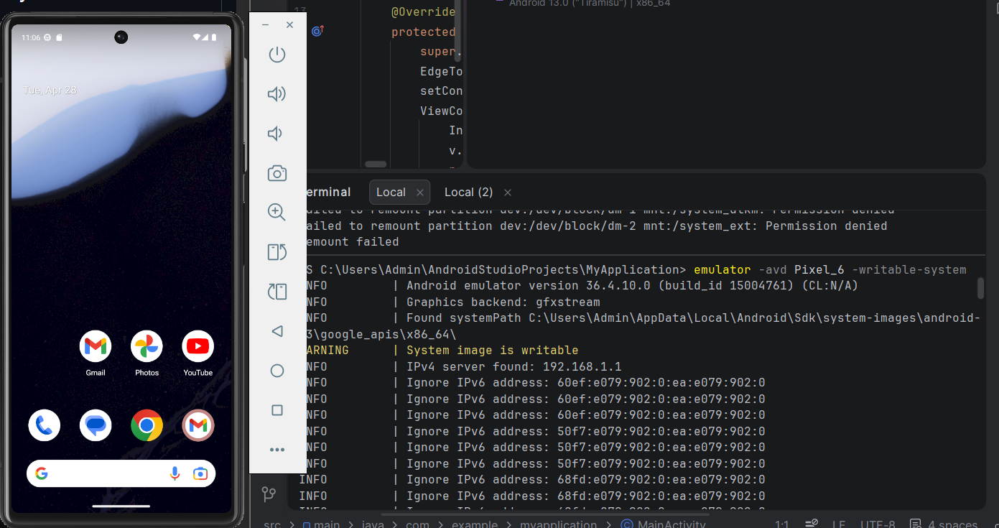
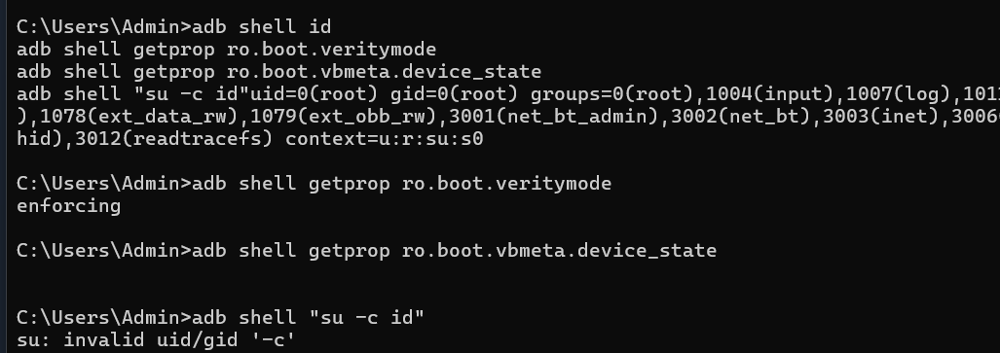
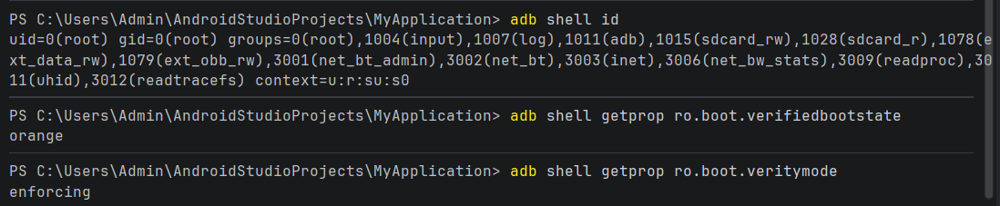

# Rapport de Laboratoire : Rooting Android & Analyse d'Intégrité

## 📌 1. Fiche Périmètre
*   **Auteur :** Noha
*   **Support :** Émulateur Android Studio (AVD) - Pixel 6
*   **Version OS :** Android 13.0 / API 33
*   **Objectif :** Comprendre le rooting, ses impacts sur le sandboxing et les mécanismes Verified Boot / AVB.
*   **Données/Réseau :** Données fictives uniquement sur réseau local isolé.

---

## 🛠️ 2. Fondamentaux Théoriques

### 2.1 Le Rooting
Le rooting consiste à obtenir les privilèges **super-utilisateur (UID 0)**. Sur Android, cela modifie la confiance du système et permet de briser le "Sandboxing" (isolation des apps). C'est un outil puissant en laboratoire pour inspecter les données privées, mais il supprime les garanties d'intégrité logicielle.

### 2.2 Verified Boot & AVB (Android Verified Boot)

*   **Verified Boot :** Garantit que le code exécuté provient d'une source de confiance (fabricant) et n'a pas été altéré.
*   **AVB :** Version moderne qui ajoute une protection contre le **rollback** (empêche de réinstaller d'anciennes versions vulnérables).
*   **Chain of Trust :** Chaque composant (bootloader, kernel, system) vérifie la signature du suivant avant de l'exécuter.

---

## 🚀 3. Méthodologie & Réalisation Technique

### Étape A : Préparation de l'environnement
L'AVD a été démarré avec l'option `-writable-system` pour permettre la modification des partitions normalement en lecture seule.

### Étape B : Élévation de privilèges & Diagnostic
L'objectif était de tester si les protections d'intégrité bloquent la modification du système.

### Étape C : Vérification de l'état de confiance
Après les manipulations, nous interrogeons les propriétés de boot pour confirmer l'état de l'appareil.

**Interprétation des résultats :**
*   **`uid=0(root)`** : Privilèges root confirmés sur le shell.
*   **`verifiedbootstate = orange`** : Indique que l'intégrité n'est plus garantie (bootloader déverrouillé/système modifié).
*   **`veritymode = enforcing`** : La vérification est toujours active, bloquant l'écriture immédiate sur `/system`.

---

## 🛡️ 4. Référentiel de Sécurité (OWASP MASVS & MASTG)

| Référence | Exigence / Test | Application dans ce Lab |
| :--- | :--- | :--- |
| **MASVS STORAGE-1** | Stockage sécurisé des données sensibles. | Le root permet d'accéder à `/data/data/` pour vérifier si les tokens sont chiffrés. |
| **MASVS NETWORK-1** | Communications TLS configurées correctement. | Permet d'installer des certificats d'autorité (CA) au niveau système pour intercepter le flux. |
| **MASTG Test 1** | Analyse des `shared_prefs`. | Inspection des fichiers XML normalement protégés par le sandbox. |
| **MASTG Test 2** | Analyse des fuites via Logcat. | Utilisation de `adb logcat` pour détecter des données sensibles en clair. |

---

## ⚠️ 5. Matrice des Risques & Mesures Défensives

1.  **Intégrité non garantie :** Les conclusions du test peuvent être biaisées. -> *Mesure : Utiliser un AVD "propre" au départ.*
2.  **Surface d'attaque accrue :** Exposition aux malwares. -> *Mesure : Réseau totalement isolé.*
3.  **Fuite de données :** Exposition des comptes. -> *Mesure : Aucun compte personnel (Google/Cloud).*
4.  **Instabilité :** Risque de "brick" logiciel. -> *Mesure : Utilisation de snapshots de l'émulateur.*
5.  **Mélange de contextes :** Données résiduelles. -> *Mesure : Wipe data systématique.*
6.  **Accès non autorisé :** Si l'appareil est perdu. -> *Mesure : Stockage des devices de lab sous clé.*
7.  **Persistance :** Modifications restant après le lab. -> *Mesure : Réinitialisation usine obligatoire.*
8.  **Traçabilité :** Difficulté à prouver les tests. -> *Mesure : Journalisation (`logcat`) et captures d'écran.*

---

## 🧹 6. Clôture & Hygiène Numérique
Pour garantir l'absence de contamination pour les prochains tests, une remise à zéro complète est effectuée.

*   **Commande :** `emulator -avd Pixel_6_API_33 -wipe-data`
*   **Preuve de Reset :** Au redémarrage, l'appareil affiche l'assistant de configuration initial (Setup Wizard).
